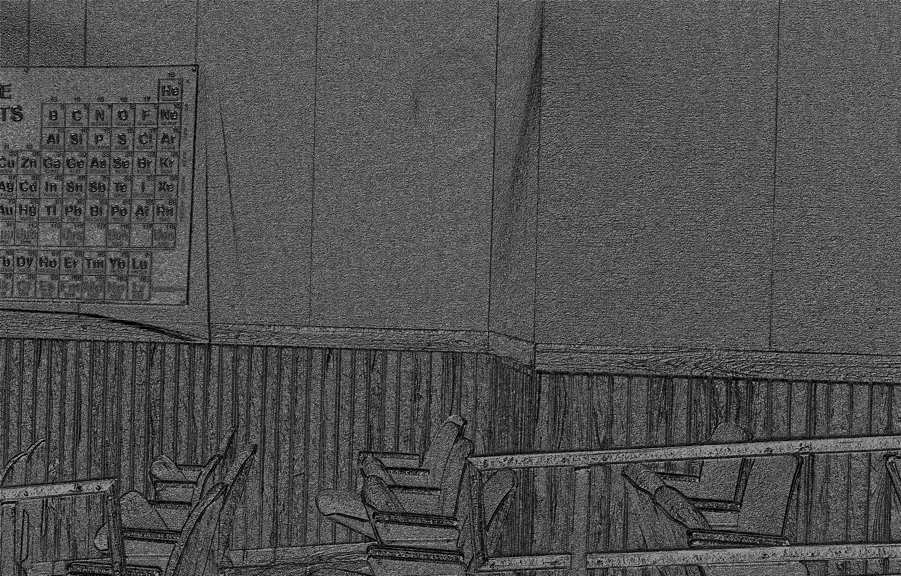

# ranktransform
perform rank transform or census transform to image, make it invariant to illumination changes, it is interesting to actually visualize how transform does  
rank transform: adding up the number of neighbors that larger than central pixel  
census transform : assigning neighbors that larger than central pixel to 1, 0 otherwise, and aggregate bits to value   

To run this code   
```bash
python rank_transform.py input_imgpath output_imgpath transform_type
```
original image:  

rank transform:  
  
census transform:  

